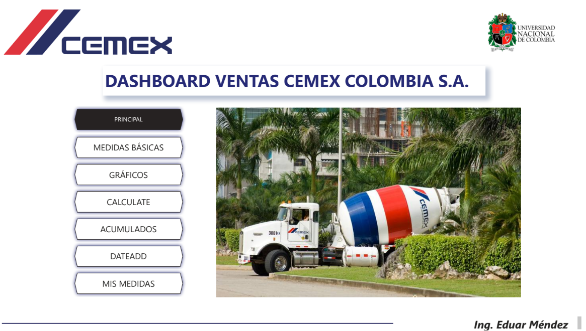
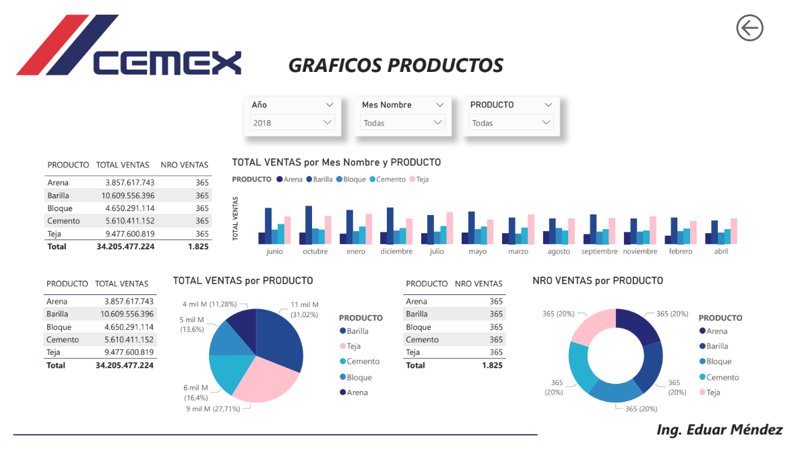

# Power-BI-analisis-ventas-cemex

# 📊 Dashboard de Ventas - CEMEX Colombia S.A.

## 📌 Descripción del proyecto

Este proyecto fue desarrollado como parte del **Parcial Final de Power BI** en la asignatura *Herramientas y problemas en Ingeniería Industrial* de la **Universidad Nacional de Colombia**.

El objetivo fue construir un **dashboard interactivo** para la empresa **CEMEX Colombia S.A.**, aplicando conceptos de:
- Transformación de datos (unpivot)
- Modelado tabular y relaciones
- Funciones DAX (básicas, CALCULATE, inteligencia de tiempo)
- Visualizaciones avanzadas y segmentaciones

Los datos representan **ventas diarias de 5 productos** durante el período **2018 - 2020**.

## 🎯 Objetivos del informe

- Analizar el comportamiento de las ventas por producto, mes, trimestre y año.
- Construir medidas de acumulado (MTD, QTD, YTD).
- Comparar ventas con períodos anteriores (DATEADD).
- Calcular participación porcentual de cada producto sobre el total.
- Entregar un dashboard profesional con navegación entre páginas.

## 🛠️ Tecnologías utilizadas

- **Power BI Desktop**
- **Power Query Editor** (transformación de datos)
- **DAX** (Data Analysis Expressions)
- **Excel** (fuente de datos original)

## 📁 Estructura del archivo `.pbix`

El dashboard contiene las siguientes **páginas**:

| Página | Contenido |
|--------|-----------|
| 🏠 **Panel Principal** | Botones de navegación a todos los informes |
| 📈 **Jerarquías** | Tabla con jerarquía Año → Trimestre → Mes → Día, mostrando Total, Promedio y N° de Ventas |
| 🎁 **Gráficos Productos** | Tablas y gráficos (columnas, pastel) por producto y mes |
| 🧮 **CALCULATE** | Medidores de ventas por producto, Gran Total y Participación |
| 📆 **Acumulados** | Tablas con TOTALMTD, TOTALQTD, TOTALYTD |
| ⏪ **DATEADD** | Comparación vs mes, trimestre y año anterior |
| 📋 **Medidas** | Listado completo de las 15 medidas DAX creadas |

## 📊 Medidas DAX implementadas

| Medida | Nombre | Función DAX |
|--------|--------|-------------|
| 1 | TOTAL VENTAS | `SUM(VENTAS_DIARIAS[Valor])` |
| 2 | PROMEDIO VENTAS | `AVERAGE(VENTAS_DIARIAS[Valor])` |
| 3 | NRO VENTAS | `COUNT(VENTAS_DIARIAS[PRODUCTO])` |
| 4 | NRO PRODUCTOS | `DISTINCTCOUNT(VENTAS_DIARIAS[PRODUCTO])` |
| 5 | VENTAS CEMENTO | `CALCULATE([TOTAL VENTAS], VENTAS_DIARIAS[PRODUCTO]="Cemento")` |
| 6 | VENTAS ARENA | `CALCULATE([TOTAL VENTAS], VENTAS_DIARIAS[PRODUCTO]="Arena")` |
| 7 | VENTAS BLOQUE | `CALCULATE([TOTAL VENTAS], VENTAS_DIARIAS[PRODUCTO]="Bloque")` |
| 8 | GRAN TOTAL VENTAS | `CALCULATE([TOTAL VENTAS], ALL(VENTAS_DIARIAS[PRODUCTO]))` |
| 9 | PARTICIPA PRODUCTO | `[TOTAL VENTAS] / [GRAN TOTAL VENTAS]` |
| 10 | ACUMULADO MES | `TOTALMTD([TOTAL VENTAS], CALENDARIO[Fecha])` |
| 11 | ACUMULADO TRIMESTRE | `TOTALQTD([TOTAL VENTAS], CALENDARIO[Fecha])` |
| 12 | ACUMULADO AÑO | `TOTALYTD([TOTAL VENTAS], CALENDARIO[Fecha])` |
| 13 | VENTAS MES ANTERIOR | `CALCULATE([TOTAL VENTAS], DATEADD(CALENDARIO[Fecha], -1, MONTH))` |
| 14 | VENTAS TRIMESTRE ANTERIOR | `CALCULATE([TOTAL VENTAS], DATEADD(CALENDARIO[Fecha], -1, QUARTER))` |
| 15 | VENTAS AÑO ANTERIOR | `CALCULATE([TOTAL VENTAS], DATEADD(CALENDARIO[Fecha], -1, YEAR))` |

## 🖼️ Vista previa del dashboard

## 📥 Archivos incluidos

- `Entregable.pdf` – reporte exportado con todas las visualizaciones.
- `EntregablePowerBi.pbix` – archivo fuente de Power BI (opcional, según decidas subirlo).

## 🚀 Cómo visualizar el dashboard

1. Clona este repositorio o descarga el archivo `.pbix`.
2. Abre con **Power BI Desktop** (versión gratuita).
3. Explora las páginas usando los botones del panel principal.
4. También puedes revisar el **PDF exportado** si no tienes Power BI.

## ⚠️ Nota importante

Este proyecto tiene **fines académicos**. Los datos de ventas son simulados y no corresponden a información real de CEMEX Colombia S.A. Los nombres de productos (Cemento, Arena, Bloque, Teja, Barilla) fueron adaptados para el ejercicio.

## 👤 Autor

**Eduar Mauricio Mendez Mendez**  
Ingeniería Industrial – Universidad Nacional de Colombia  
[LinkedIn](https://www.linkedin.com/in/eduar-mendez) | [GitHub](https://github.com/edmendezm)

## 📅 Fecha

Parcial realizado en **2022** (publicado como portafolio en 2026).

---

*“Transformar datos en decisiones”*
